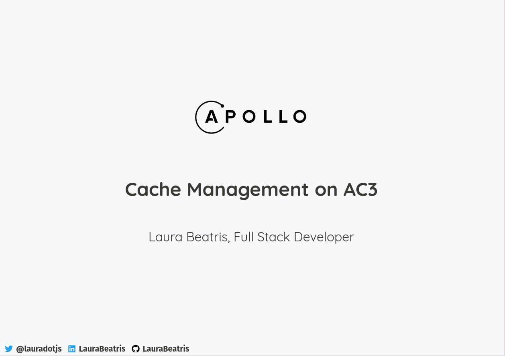

# Apollo Cache Management Talk 

> [Watch the talk here](https://www.twitch.tv/videos/798481471)



## Goals 

In the end of this talk will understand the following topics related to cache on Apollo:

- Cache Normalization
- Fetch Policies
- Type Policies
- Field Policies 
- Pagination Helpers

## Development

To run the presentation deck in development mode:

```sh
npm start
```

## Exporting

To build the presentation deck:

```sh
npm run build
```
