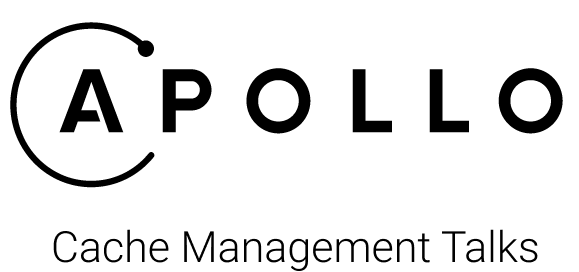

<p align="center">
  
</p>

## Events

> Apollo Day - [Talk](https://www.twitch.tv/videos/798481471) & [Slides](https://apollo-cache-management-talk.vercel.app/)

## Goals 

Understand the following topics related to cache on Apollo:

- Cache Normalization
- Fetch Policies
- Type Policies
- Field Policies 
- Pagination Helpers

## Development

To run the presentation deck in development mode:

```sh
npm start
```

## Exporting

To build the presentation deck:

```sh
npm run build
```
